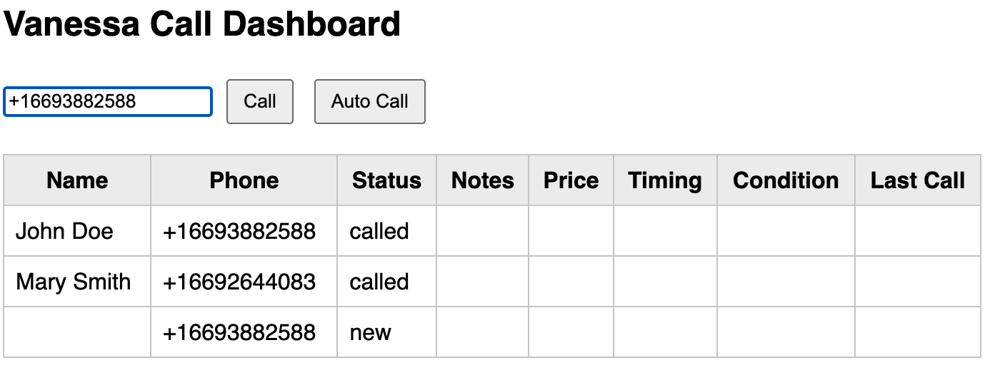

# 🏠 Vanessa Voice AI – Property Acquisitions Demo

**Vanessa** is a demo **Voice AI assistant** built for a **property acquisitions company**.  
She automatically calls homeowners, talks with them naturally to learn about their selling interest, and updates a live dashboard with results.

This project demonstrates how to combine:

- **[Vapi.ai](https://vapi.ai)** for AI-powered voice calling  
- **Node.js + Express** for backend logic  
- **A simple HTML dashboard** for monitoring calls and adding new numbers  

---

## 💡 What Vanessa Does

1. **Reads a list of homeowners** from `owners.json`.  
2. **Makes outbound calls** through the Vapi API.  
3. **Detects intent** — finds out if the homeowner wants to sell within ~90 seconds.  
4. **Asks key questions** — price range, timing, and property condition.  
5. **Updates status** automatically via the assistant’s tool calls:  
   - `interested` → homeowner may want to sell  
   - `call_later` → follow up later  
   - `dnc` → do not call  
   - `not_interested` → not selling  
6. **Logs results** in a local dashboard for review.  
7. **Allows manual calls** — you can add a new number and call it directly from the dashboard.  

---

## 🧠 How It Works

### server (`server/`)
- `server.js` runs an Express server handling:
	- `POST /api/autoCall` → start call on owners list one_by_one through Vapi
  - `POST /api/call` → start call on input phone number if it never called
  - `POST /api/owner/update` → update owner info when Vanessa calls the tool  
  - `POST /webhooks/vapi` → receive real-time Vapi call and tool events  
- Owner data is stored locally in `owners.json`.  

### update assistant seeting (`assistant/`)
- `assistant/vanessa_prompt.txt` defines the AI assistant’s tone, logic, and conversation flow.  
- `assistant/update_assistant.js` can update the Vapi assistant’s prompt automatically from your file.  

### Frontend (`public/`)
- A simple dashboard shows all owners and their statuses in a table.  
- Prevents duplicate or concurrent calls to the same number.  

---

## ⚙️ Setup


### 1. Clone and install
```bash
git clone git@github.com:xiaomin1015/property_acquisitions.git
npm install
node server/server.js
ngrok http 3000
